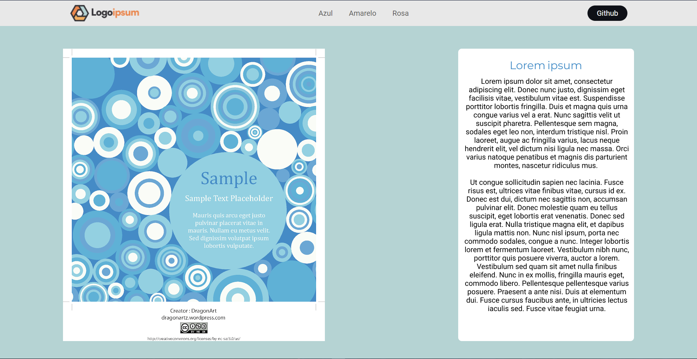

# LandingPage-Revisao

<!---Esses são exemplos. Veja https://shields.io para outras pessoas ou para personalizar este conjunto de escudos. Você pode querer incluir dependências, status do projeto e informações de licença aqui--->

> Projeto feito como revisão para a prova de artes do COTEMIG.

### Ajustes e melhorias

O projeto ainda está em desenvolvimento e as próximas atualizações serão voltadas nas seguintes tarefas:

- [x] Estrutura
- [x] NavBar
- [x] Formatação
- [ ] Rensponsividade
- [ ] Footer

## 🤝 Colaboradores

Agradecemos às seguintes pessoas que contribuíram para este projeto:

<table>
  <tr>
    <td align="center">
      <a href="#">
         
        
          <b>Pedro Veiga Ribeiro</b>
        
      </a>
    </td>
    <td align="center">
      <a href="#">
         
        
          <b>Matheus Freitas Campos</b>
        
      </a>
    </td>
<!--     <td align="center">
      <a href="#">
         
        
          <b>Steve Jobs</b>
        
      </a>
    </td> -->
  </tr>
</table>

[⬆ Voltar ao topo](#nome-do-projeto) 